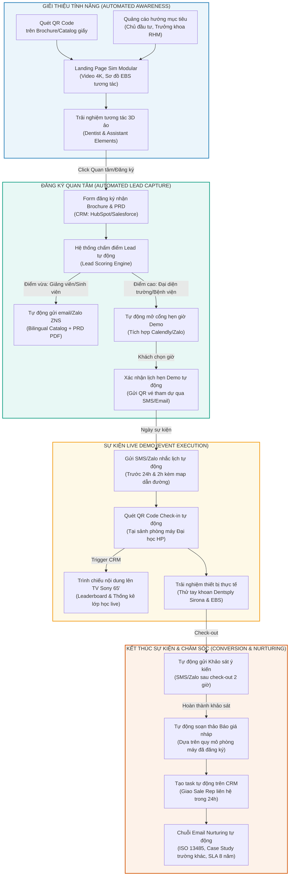

# TÀI LIỆU THIẾT KẾ Ý TƯỞNG (CONCEPT DESIGN)
## QUY TRÌNH TỰ ĐỘNG HÓA SỰ KIỆN (EVENT MARKETING AUTOMATION FLOW)
### Hệ Thống Ghế Răng Mô Phỏng Nha Khoa Sim Modular

> [!NOTE]
> Tài liệu này thiết kế một kiến trúc tự động hóa khép kín (Closed-loop Automation) từ khâu tiếp cận, giới thiệu tính năng, đăng ký tham gia sự kiện demo thực tế, vận hành tại chỗ, cho đến khâu chăm sóc hậu sự kiện. Quy trình được thiết kế nhằm tối ưu hóa tỷ lệ chuyển đổi của các dự án đấu thầu và mua sắm thiết bị y tế y khoa chất lượng cao (điển hình như dự án Trường Đại học Y Dược Hải Phòng).

---

## 1. SƠ ĐỒ QUY TRÌNH TỰ ĐỘNG HÓA TỔNG THỂ (END-TO-END WORKFLOW)

Sơ đồ dưới đây mô tả hành trình tự động hóa tương tác với khách hàng thông qua 4 giai đoạn lớn: **Giới thiệu (Awareness) -> Thu hút (Lead Capture) -> Sự kiện thực tế (Live Event) -> Chuyển đổi (Conversion)**.



---

## 2. MÔ TẢ CHI TIẾT TỪNG BƯỚC CÔNG NGHỆ TỰ ĐỘNG (AUTOMATION DETAILS)

### Giai đoạn 1: Giới thiệu tính năng (Automated Awareness)
Mục tiêu là tiếp cận chính xác tệp khách hàng tiềm năng và khơi gợi sự tò mò về công nghệ của Sim Modular bằng nội dung số hóa cao cấp.
1.  **Hệ thống cổng thông tin (Landing Page):** Xây dựng một Landing Page chuyên biệt, tối ưu hóa cho di động. Điểm nhấn là video 4K quay cận cảnh tay khoan Dentsply Sirona hoạt động mượt mà và mô phỏng trực quan mạng EBS truyền tín hiệu không trễ.
2.  **QR Code thông minh:** Trên tất cả các brochure, catalog in ấn gửi cho trường Đại học Y Dược Hải Phòng đều tích hợp QR Code động. Khi quét, hệ thống tự động nhận diện nguồn quét (ví dụ: quét từ catalog khoa RHM Hải Phòng) để cá nhân hóa nội dung chào mừng trên Landing Page.

### Giai đoạn 2: Đăng ký quan tâm (Automated Lead Capture)
Mục tiêu là thu thập thông tin chất lượng cao và lọc ra các quyết định mua sắm (Decision Makers) để chăm sóc chuyên sâu.
1.  **Form đăng ký thông minh (Smart Form):** Tích hợp biểu mẫu động thu thập: *Họ tên, Đơn vị công tác, Chức vụ (Hiệu trưởng, Trưởng khoa, Kỹ thuật viên), Quy mô phòng máy mong muốn (số ghế sinh viên), Thời gian dự kiến mua sắm.*
2.  **Phân loại tự động (Lead Scoring):** 
    *   *Nhóm A (Khách hàng VIP - Quyết định mua):* Chức vụ thuộc Ban giám hiệu, Trưởng khoa, Ban quản lý dự án. Quy mô phòng máy $\ge$ 10 ghế.
        *   -> **Hành động tự động:** Gửi link đặt lịch hẹn Demo thực tế (Calendly/Zalo) kèm sơ đồ đường đi phòng máy. Cập nhật trạng thái "Khách hàng Tiềm năng Cao" lên CRM và thông báo tức thời cho Giám đốc kinh doanh qua Slack/Zalo.
    *   *Nhóm B (Khách hàng tiềm năng vừa):* Giảng viên RHM, kỹ thuật viên thiết bị.
        *   -> **Hành động tự động:** Gửi tự động tài liệu PRD tiếng Việt và catalog chi tiết qua Zalo/Email.
3.  **Xác nhận lịch và Vé sự kiện:** Ngay khi khách nhóm A chọn giờ trên lịch trực tuyến, hệ thống tự động tạo mã QR Code cá nhân đóng vai trò là "Vé Check-in sự kiện" gửi qua Zalo/Email.

### Giai đoạn 3: Vận hành Sự kiện Live Demo (Event Execution)
Mục tiêu là tạo ấn tượng "Wow" mạnh mẽ khi khách hàng đến tham dự buổi Demo thực tế tại phòng máy mẫu của trường Đại học.
1.  **Nhắc lịch tự động:** Hệ thống SMS/Zalo gửi thông báo nhắc lịch tự động trước 24 giờ và trước 2 giờ trước giờ hẹn của khách hàng, đính kèm định vị vị trí phòng máy mẫu.
2.  **Check-in 1 chạm:** Tại sảnh sự kiện, khách hàng chỉ cần quét mã QR Code trên điện thoại vào máy quét. 
    *   Hệ thống tự động in thẻ tên sự kiện.
    *   **Hiệu ứng Wow trên TV Sony 65' 4K:** Ngay khi quét, màn hình lớn Sony 65 inch tại phòng máy tự động hiển thị dòng chữ: *"Chào mừng [Học hàm/Học vị] [Tên Giảng viên] - [Chức vụ] Khoa Răng Hàm Mặt Trường Đại học Y Dược Hải Phòng đến với Không gian trải nghiệm Sim Modular"* cùng hiệu ứng âm thanh vòm sống động của TV.
3.  **Trải nghiệm thực tế (Hands-on):** Giảng viên trực tiếp thao tác mẫu, hệ thống EBS truyền tức thời hình ảnh của họ lên TV Sony 65" và toàn bộ màn hình sinh viên 24" xung quanh để chứng minh tính năng không độ trễ.

### Giai đoạn 4: Chăm sóc sau sự kiện (Post-Event Conversion)
Mục tiêu là duy trì nhiệt lượng quan tâm và tự động cung cấp các hồ sơ thủ tục hành chính, kỹ thuật cần thiết để chuẩn bị cho giai đoạn đấu thầu.
1.  **Khảo sát ý kiến tự động:** Đúng 2 tiếng sau khi khách hàng check-out khỏi sự kiện, một tin nhắn Zalo/SMS chứa link khảo sát ngắn (3 câu hỏi về trải nghiệm tay khoan, chất lượng EBS và độ hài lòng tổng thể) được gửi đi.
2.  **Tự động tạo Đề xuất & Báo giá nháp (Automated Proposal Generation):**
    *   Nếu trong form khảo sát hoặc đăng ký ban đầu khách ghi quy mô mong muốn là **15 ghế sinh viên + 1 ghế giảng viên**, hệ thống CRM tự động tính toán định mức chi phí dựa trên đơn giá chuẩn và tạo ra một bản đề xuất cấu hình kỹ thuật & báo giá nháp định dạng PDF được cá nhân hóa hoàn toàn.
    *   Bản đề xuất này tự động gửi đến email của khách kèm lời cảm ơn.
3.  **Giao việc tự động cho Sales Rep (Auto Task Assignment):** Hệ thống tự động tạo task trên CRM yêu cầu nhân viên phụ trách khu vực (ví dụ: khu vực Hải Phòng) liên hệ trực tiếp bằng điện thoại trong vòng 24 giờ tiếp theo để tư vấn chuyên sâu về quy trình đấu thầu.
4.  **Chuỗi Email nuôi dưỡng (Nurturing Email Flow):** Gửi định kỳ 3 ngày/lần các thông tin giá trị bổ sung:
    *   *Email 1:* Tiêu chuẩn **ISO 13485** ảnh hưởng thế nào đến độ an toàn của phòng thực hành.
    *   *Email 2:* Nghiên cứu điển hình (Case Study) về một trường đại học đã tối ưu hóa chất lượng đào tạo nhờ hệ thống EBS.
    *   *Email 3:* Cam kết cung cấp phụ tùng thay thế dài hạn trong **08 năm** (đáp ứng Thông tư 23/2023/TT-BTC) giúp tối ưu hóa chi phí đầu tư.

---

## 3. KIẾN TRÚC HỆ THỐNG DỮ LIỆU & PHẦN MỀM ĐỀ XUẤT (TECH STACK)

Để vận hành trơn tru quy trình tự động hóa trên, hệ thống phần mềm đề xuất bao gồm:

```
[Công cụ Marketing: Landing Page + QR] 
                 |
                 v (Dữ liệu đăng ký)
[Hệ thống CRM: HubSpot / Salesforce] <--> [Lịch hẹn trực tuyến: Calendly]
                 |
                 +--> (Trigger) --> [Hệ thống tin nhắn: Zalo ZNS / Twilio SMS]
                 |
                 +--> (Trigger) --> [Check-in App: QR Scanner app tại sự kiện]
                 |
                 +--> (Tạo báo giá) -> [Hệ thống PDF Builder: DocuSign / HubSpot Quote]
```

1.  **Phần mềm quản trị quan hệ khách hàng (CRM):** **HubSpot Sales Hub** (Khuyên dùng vì có tính năng Marketing Automation cực kỳ mạnh mẽ, giao diện trực quan và tích hợp sẵn công cụ chấm điểm Lead Scoring tự động).
2.  **Kênh tương tác tin nhắn:** **Zalo Notification Service (ZNS)** tích hợp số điện thoại thương hiệu (Brandname SMS) để truyền tải thông điệp nhanh, chính thống và chuyên nghiệp tại thị trường Việt Nam.
3.  **Hệ thống đặt lịch tự động:** **Calendly** tích hợp sâu vào HubSpot và Google Calendar của đội ngũ kỹ sư ứng dụng để tránh chồng chéo lịch Demo.
4.  **Ứng dụng Check-in tại sự kiện:** Xây dựng một ứng dụng web-app di động đơn giản kết nối trực tiếp API với HubSpot. Khi quét mã QR của khách tham dự, ứng dụng lập tức chuyển trạng thái của Contact đó sang "Đã tham dự sự kiện" (Attended Event) để kích hoạt các kịch bản sau sự kiện.

---

## 4. CHỈ SỐ ĐÁNH GIÁ HIỆU QUẢ QUY TRÌNH (KPIS & METRICS)

Hệ thống dashboard tự động trên CRM sẽ giám sát các chỉ số sức khỏe của quy trình theo thời gian thực:
*   **Tỷ lệ Quét QR / Lượt truy cập Landing Page:** Đánh giá độ hấp dẫn của tài liệu in ấn và thiết kế catalog.
*   **Tỷ lệ Đăng ký (Conversion Rate):** Lượt đăng ký thành công / Tổng số lượt truy cập Landing Page (Mục tiêu: $\ge 15\%$).
*   **Tỷ lệ Tham dự (Attendance Rate):** Lượt khách hàng check-in thực tế / Tổng số khách đặt lịch (Mục tiêu: $\ge 85\%$).
*   **Tỷ lệ Phản hồi Khảo sát (Survey Response Rate):** Số phiếu khảo sát hoàn thành / Lượt khách tham dự (Mục tiêu: $\ge 60\%$).
*   **Tốc độ phản hồi của Sales (Sales Response Time):** Thời gian trung bình từ khi khách hàng hoàn thành sự kiện đến khi nhân viên kinh doanh gọi điện chăm sóc (Mục tiêu: $< 12$ tiếng làm việc).
